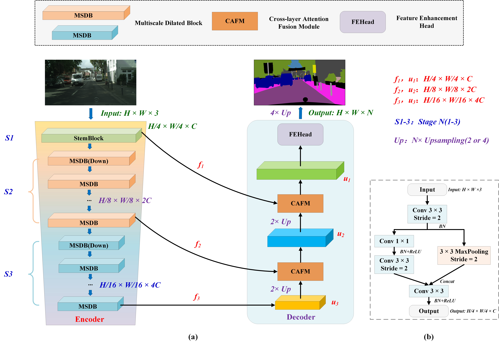
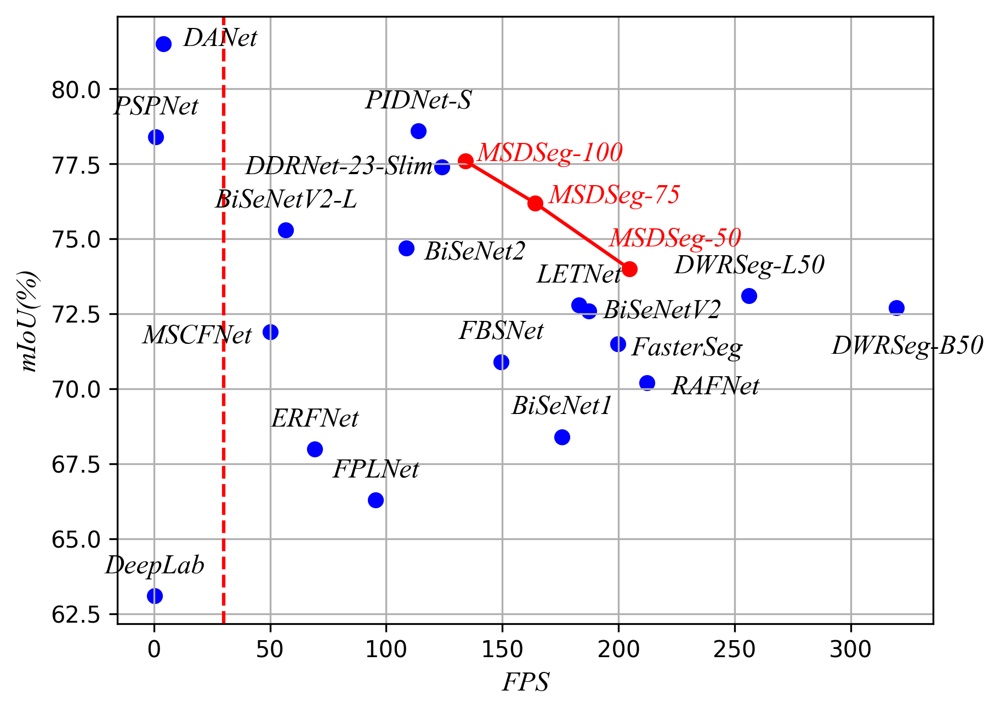
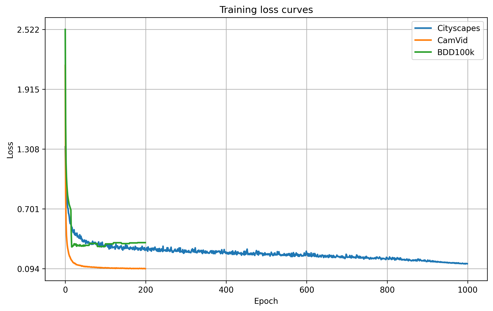

# MSDSeg

#### The official implementation of "Lightweight and Real-Time Semantic Segmentation Network with MultiScale Dilated Convolutions"

MSDSeg



Comparison of MSDSeg with some state-of-the-art methods on the Cityscapes test dataset.



The loss convergence curve of our MSDSeg on Cityscapes (Blue) and CamVid (Orange) and BDD100k (Green) datasets.




### Setup
Install the dependencies in requirements.txt by using pip and [virtualenv](
https://packaging.python.org/guides/installing-using-pip-and-virtual-environments/).

### Download Cityscapes
go to https://www.cityscapes-dataset.com, create an account, and download
gtFine_trainvaltest.zip and leftImg8bit_trainvaltest.zip.
Unzip both of them and put them in a directory called cityscapes_dataset.
The cityscapes_dataset directory should be inside the MSDSeg directory.
If you put the dataset somewhere else, you can set the config field
```
config["dataset_dir"]="the location of your dataset"
```
You can delete the test images to save some space if you don't want to submit to the competition.
Make sure that you have downloaded the required python packages and run
```
CITYSCAPES_DATASET=cityscapes_dataset csCreateTrainIdLabelImgs
```
There are 19 classes.

### Training
If you want to train the MSDSeg network on the Cityscapes dataset, please use the following instructions:
```
python train.py --config config/cityscapes_1000epoch_msdseg.yaml
```

### Usage
To visualize your model, go to show_cityscapes.py.

To see the model definitions and do some speed tests, go to MSDSeg.py.

To train, validate, benchmark, and save the results of your model, go to train.py.

### Citation
If you find our work helpful, please consider citing our paper.

```
@article{wang2025msdseg,
  title={Lightweight and Real-Time Semantic Segmentation Network with MultiScale Dilated Convolutions},
  author={Shan Zhao, Yunlei Wang, Zhanqiang Huo, Fukai Zhang},
  journal={The Visual Computer},
  year={2025}
}
```
